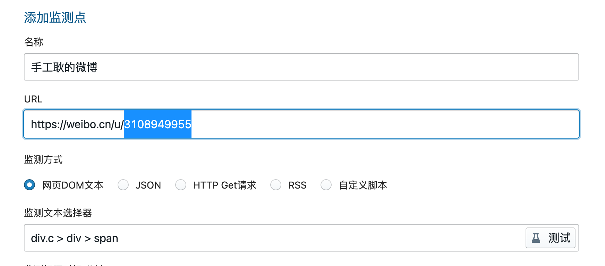

Check酱任务分享清单

<!--ts-->
<!--te-->

# 使用说明

## 安装Check酱

请按[官网](http://ckc.ftqq.com)提示进行安装

## 浏览本页面寻找喜欢的任务

## 复制任务并粘贴到插件页面

## 如有提示，请根据提示修改URL或者选择器

## 点击测试查看是否正确

## 配置SendKey，推送到微信

## 添加到列表，定时执行


# 社交网站

## 微博

### UID 获取方式

登入 weibo.cn ，进入用户页面，点击「资料」，浏览器地址栏中 

```
https://weibo.cn/xxx/info
```

`xxx`部分即为用户UID

### 博主更新

```
checkchan://title=%E6%89%8B%E5%B7%A5%E8%80%BF%E7%9A%84%E5%BE%AE%E5%8D%9A&url=https%3A%2F%2Fweibo.cn%2Fu%2F3108949955&path=div.c%20%3E%20div%20%3E%20span&type=dom&code=200&json_data_format=form&rss_field=title&delay=0&retry=10&cron=*%20*%20*%20*%20*&when=change&compare_type=all&compare_op=ne&compare_value=*%E4%B8%8A%E6%AC%A1%E7%9B%91%E6%B5%8B%E8%BF%94%E5%9B%9E%E5%80%BC*&shell_type=javascript
```

粘贴后修改URL中的 `/u/` 后的数字为用户UID

 


## Bilibili

## Twitter

# 电商网站