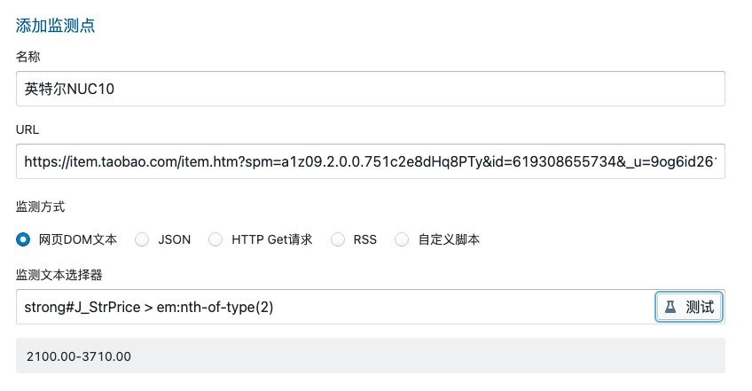

Check酱任务分享清单

<!--ts-->
* [使用说明](#使用说明)
   * [安装Check酱](#安装check酱)
   * [浏览本页面寻找喜欢的任务](#浏览本页面寻找喜欢的任务)
   * [复制任务并粘贴到插件页面](#复制任务并粘贴到插件页面)
   * [如有提示，请根据提示修改URL或者选择器](#如有提示请根据提示修改url或者选择器)
   * [点击测试查看是否正确](#点击测试查看是否正确)
   * [配置SendKey，推送到微信](#配置sendkey推送到微信)
   * [添加到列表，定时执行](#添加到列表定时执行)
* [社交网站](#社交网站)
   * [微博](#微博)
      * [UID 获取方式](#uid-获取方式)
      * [博主更新](#博主更新)
   * [Bilibili](#bilibili)
   * [Twitter](#twitter)
* [电商网站](#电商网站)
<!--te-->

# 使用说明

1. 请按[官网](http://ckc.ftqq.com)提示进行安装
1. 浏览本页面寻找喜欢的任务
1. 复制`任务编码`并粘贴到插件页面
1. 如有提示，请根据提示修改URL或者选择器
1. 点击测试查看是否正确
1. 配置SendKey，推送到微信
1. 添加到列表，定时执行

> Check酱可以监测绝大多数网页，此列表主要提供思路和参考，可查看[B站视频教程](https://www.bilibili.com/video/BV1K94y1m7tt)了解如何检测任意页面

# 社交网站

## 微博

### 用户UID 获取方式

登入 weibo.cn ，进入用户页面，点击「资料」，浏览器地址栏中 

```
https://weibo.cn/xxx/info
```

`xxx`部分即为用户UID

### 博主更新

思路：选取手机WAP版用户页面的第一条微博正文。注意不要把转赞评选进去，不然会一直变。

#### 演示：手工耿的微博更新

<https://weibo.cn/u/3108949955>

  

#### 任务编码

```
checkchan://title=%E6%89%8B%E5%B7%A5%E8%80%BF%E7%9A%84%E5%BE%AE%E5%8D%9A&url=https%3A%2F%2Fweibo.cn%2Fu%2F3108949955&path=div.c%20%3E%20div%20%3E%20span&type=dom&code=200&json_data_format=form&rss_field=title&delay=0&retry=10&cron=*%20*%20*%20*%20*&when=change&compare_type=all&compare_op=ne&compare_value=*%E4%B8%8A%E6%AC%A1%E7%9B%91%E6%B5%8B%E8%BF%94%E5%9B%9E%E5%80%BC*&shell_type=javascript
```

#### 改为其他用户

粘贴任务到Check酱后修改`URL`中的 `/u/` 后的数字为用户UID

 

## B站

### 番剧更新

思路：选择移动版界面，上边直接有更新集数，用选择器点击即可

#### 演示：辉夜大小姐

<https://m.bilibili.com/bangumi/play/ss41411>

  

#### 任务编码

```
checkchan://title=%E8%BE%89%E5%A4%9C%E5%A4%A7%E5%B0%8F%E5%A7%90%E6%83%B3%E8%AE%A9%E6%88%91%E5%91%8A%E7%99%BD%20-%E7%A9%B6%E6%9E%81%E6%B5%AA%E6%BC%AB&url=https%3A%2F%2Fm.bilibili.com%2Fbangumi%2Fplay%2Fss41411&path=div%23app%20%3E%20div%3Anth-of-type(2)%20%3E%20div%20%3E%20div%3Anth-of-type(5)%20%3E%20div%20%3E%20i&type=dom&code=200&json_data_format=form&rss_field=title&delay=0&retry=10&cron=*%20*%20*%20*%20*&when=change&compare_type=all&compare_op=ne&compare_value=*%E4%B8%8A%E6%AC%A1%E7%9B%91%E6%B5%8B%E8%BF%94%E5%9B%9E%E5%80%BC*&shell_type=javascript&ua=Mozilla%2F5.0%20(iPhone%3B%20CPU%20iPhone%20OS%2013_2_3%20like%20Mac%20OS%20X)%20AppleWebKit%2F605.1.15%20(KHTML%2C%20like%20Gecko)%20Version%2F13.0.3%20Mobile%2F15E148%20Safari%2F604.1%20Edg%2F101.0.4951.64
```

#### 改为其他番剧

粘贴任务到Check酱后修改`URL`中的 `/play/` 后的数字为番剧ID

  

## 抖音

### 用户更新

思路：抖音网页版用户页面上有作品数，监测总数即可

#### 演示：李子柒

<https://www.douyin.com/user/MS4wLjABAAAAPCnTQLqza4Xqu-uO7KZHcKuILkO7RRz2oapyOC04AQ0>

  

#### 任务编码

```
checkchan://title=%E6%9D%8E%E5%AD%90%E6%9F%92%E7%9A%84%E4%B8%BB%E9%A1%B5%20-%20%E7%BE%8E%E9%A3%9F%E8%87%AA%E5%AA%92%E4%BD%93%20-%20%E6%8A%96%E9%9F%B3&url=https%3A%2F%2Fwww.douyin.com%2Fuser%2FMS4wLjABAAAAPCnTQLqza4Xqu-uO7KZHcKuILkO7RRz2oapyOC04AQ0&path=div%23root%20%3E%20div%20%3E%20div%3Anth-of-type(2)%20%3E%20div%20%3E%20div%20%3E%20div%3Anth-of-type(4)%20%3E%20div%20%3E%20div%20%3E%20div%20%3E%20span&type=dom&code=200&json_data_format=form&rss_field=title&delay=0&retry=10&cron=*%20*%20*%20*%20*&when=change&compare_type=all&compare_op=ne&compare_value=*%E4%B8%8A%E6%AC%A1%E7%9B%91%E6%B5%8B%E8%BF%94%E5%9B%9E%E5%80%BC*&shell_type=javascript
```

#### 改为其他用户

粘贴任务到Check酱后修改`URL`中的 `/user/` 后的字符串为用户ID

  


# 电商网站

## 京东

### 降价通知

思路：监测商品页面的价格文字，并开启条件比较发送规则

  

#### 演示：京东京造 1TB SSD固态硬盘

<https://item.jd.com/100017905286.html>

  

#### 任务代码

```
checkchan://title=%E3%80%90%E4%BA%AC%E4%B8%9C%E4%BA%AC%E9%80%A0JZ-SSD1T-5%E3%80%91&url=https%3A%2F%2Fitem.jd.com%2F100017905286.html&path=span.price.J-p-100017905286&type=dom&code=200&json_data_format=form&rss_field=title&delay=0&retry=10&cron=*%20*%20*%20*%20*&when=change&compare_type=op&compare_op=lt&compare_value=*%E4%B8%8A%E6%AC%A1%E7%9B%91%E6%B5%8B%E8%BF%94%E5%9B%9E%E5%80%BC*&shell_type=javascript
```

#### 改为其他商品

粘贴任务到Check酱后修改`URL`和`选择器`中的 `商品ID` 即可

  

## 淘宝


### 商品价格

思路：淘宝的商品多个价格集中到一起显示，需要先点击对应项才能提取到内容，这就需要云端的自定义代码；同时，淘宝禁止了公用机房IP访问，因此这个云端最好是部署在自己家里。

#### 演示：NUC10

<https://item.taobao.com/item.htm?spm=a1z09.2.0.0.751c2e8dHq8PTy&id=619308655734&_u=9og6id2619>

首先在要选择的「颜色分类」小方块上点右键，检查元素，再在开发者工具中被选中的HTML代码上右键，选择复制→复制Selector，可以得到方块的选择器。

类似这样

```
#J_isku > div > dl.J_Prop.tb-prop.tb-clear.J_Prop_Color > dd > ul > li:nth-child(1) > a
```

在右键「定位监测对象」，然后点商品价格，生成自动添加数据

  

点测试可以看到这个价格是一个区间。

  

点击页面最下方的「自定义代码」，填入「自定义puppeteer代码」

```javascript
await page.click('#J_isku > div > dl.J_Prop.tb-prop.tb-clear.J_Prop_Color > dd > ul > li:nth-child(1) > a')
```

这段代码的意思是，在提取数据前，去点一下第一个小方块。


  

然后在列表中，把这个任务配置成云端执行，可以看到返回的价格就只有2100了。

  


注意：

1. 需要部署云端
1. 云端的出口IP不能是公用机房IP

### 物流进度

思路：淘宝网页版订单物流页面，选择状态文字即可

  

> 由于此页面属于个人订单，因此不提供任务代码，自行用选择器选择即可

